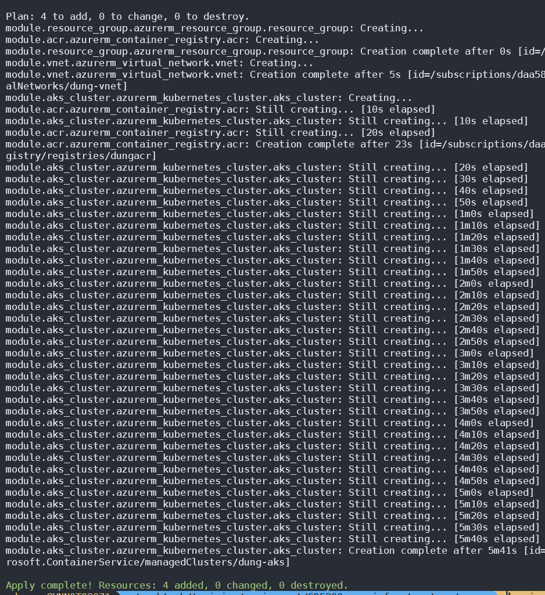

# SD5200_azure_infrastructure

Provision codes and manifest files will be stored in this repository.

## Requirement

You must login azure cli:
<https://learn.microsoft.com/en-us/cli/azure/authenticate-azure-cli>

> _If you using WSL on Windows_
>
> export your browser you are currently using, Example: 
>
> `export BROWSER='/mnt/c/Program Files/Mozilla Firefox/firefox.exe'`

`az login`

Or you want to login into your tenant

`az login --tenant "tenant_id"`

Done to login azure cli

## Terraform

Run 3 divine commands

> `terraform init`
>
> `terraform plan -var-file="terraform.tfvars"`
>
> `terraform apply`

Wait about 6 minutes and we will complete

## Checking resources on Azure console

My main resource group

AKS Resource group

I provision AKS and Worker nodes in different vnet

